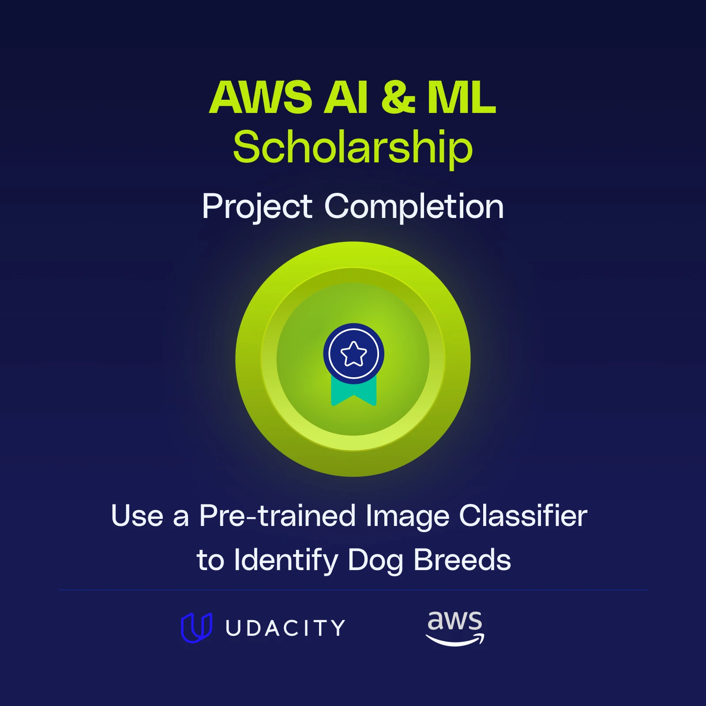

# Udacity Project: Use a Pre-trained Image Classifier to Identify Dog Breeds

## Overview

This repository contains the implementation of a project for the Udacity Machine Learning Nanodegree. The objective of this project is to use a pre-trained image classifier to identify dog breeds. The project demonstrates the application of transfer learning techniques to classify images of dogs into different breeds.

## Project Structure

The project is structured as follows:

- `get_pet_labels.py`: This script is responsible for extracting pet labels from the image files.
- `README.md`: This file provides an overview and guidelines for the project.
- `Picture_ReadMe/`: This directory contains the images used in the README.

## Instructions

To help improve your code, consider the following recommendations:

- Implement one suggestion at a time and run your code before implementing another. This ensures that if an error occurs, you know which change led to it.
- Do not remove your own code before implementing a suggestion. Instead, comment out the part of the code you are changing.
- Always check that with each new implementation, you are still getting the correct output.

## Resources

Here is a summary of useful links that may help you with the project:

- [The Python time.sleep() function](https://docs.python.org/3/library/time.html#time.sleep)
- [The choices parameter of Argparse](https://docs.python.org/3/library/argparse.html#choices)
- [The type parameter of Argparse](https://docs.python.org/3/library/argparse.html#type)
- [The .join() Function](https://docs.python.org/3/library/stdtypes.html#str.join)
- [List Comprehension](https://docs.python.org/3/tutorial/datastructures.html#list-comprehensions)
- [The .items() Method of Dictionaries](https://docs.python.org/3/library/stdtypes.html#dict.items)
- [The .values() Method of Dictionaries](https://docs.python.org/3/library/stdtypes.html#dict.values)
- [The os.path.join() Function](https://docs.python.org/3/library/os.path.html#os.path.join)

## Conclusion

Great job overall on the project! I hope you learned a lot from working on it. Enjoy the remaining lessons of the Nanodegree and Stay Udacious! 💪
